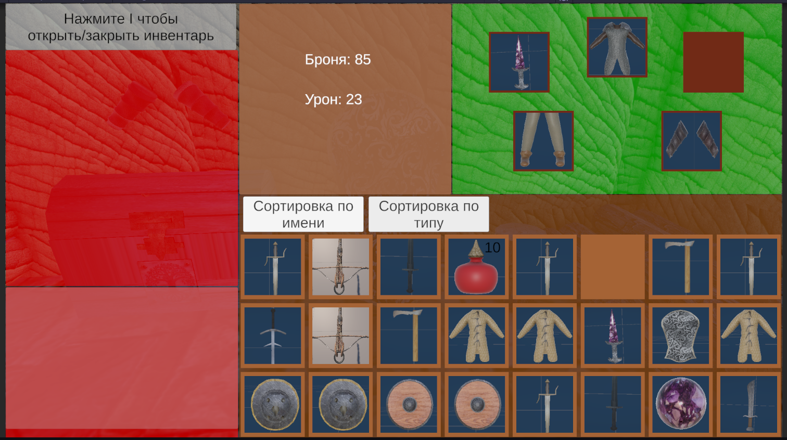
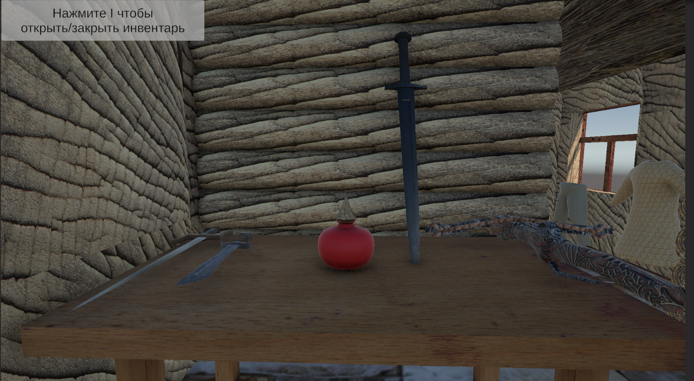
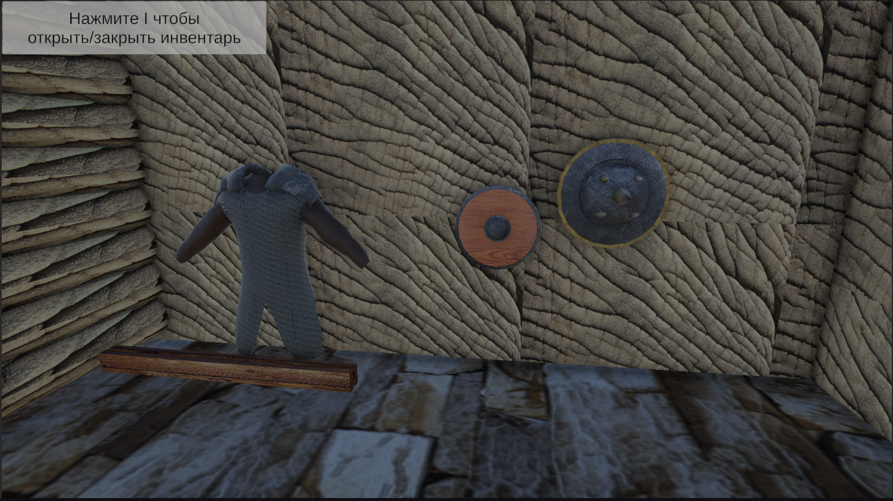
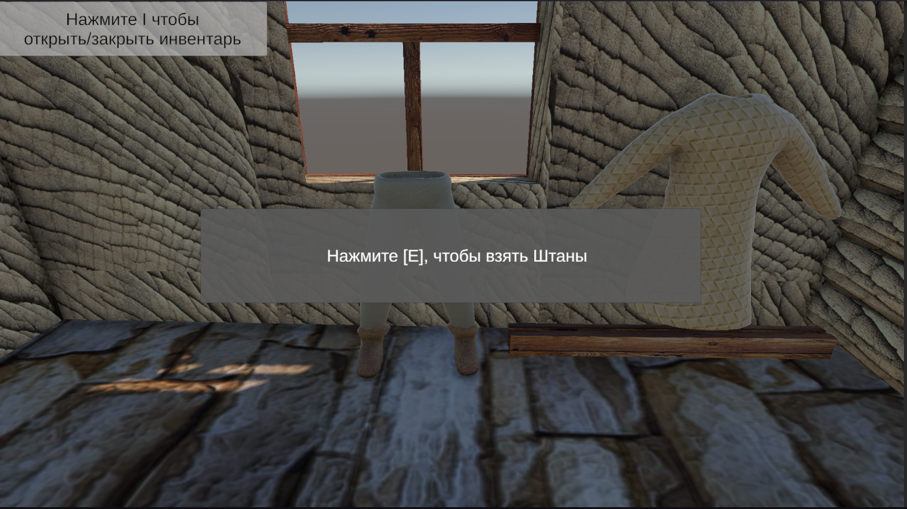
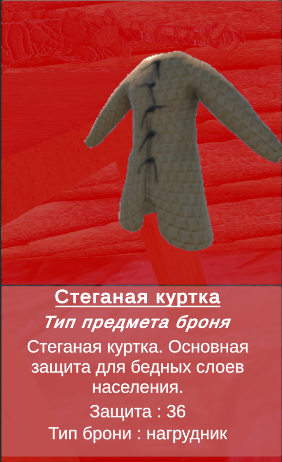
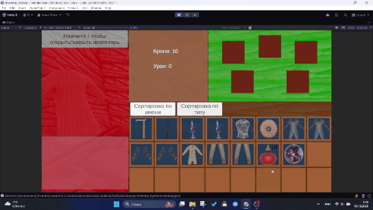

# InventarySystem
Система инвентаря. 

Игра представляет собой одну комнату, в которой есть разные предметы, которые можно подбирать. Эти вещи разделяются на ветринные и исчезающие, ветринные можно подбирать бесконечно, а обычные исчезают после подбора. Все ассеты были созданы самостоятельно в Blender 3d ранее. Инвентарь разделен на несколько областей. Сам инвентарь, экипировка, характеристики игрока, панель превью и информация о предмете. Скрипты писались так, чтобы было легко добавлять новые типы предметов не меняя старые скрипты, UI имеет слабую связь с логикой. 
Проект реализовавает инвентарь с системой drag and drop. Инвентарь имеет фиксированное колличество слотов, где каждый слот может занимать только один предмет. Можно перетаскивать предметы из инвентаря в экипируемые слоты для надевания предметов. Есть система превью, которая отображает 3д модель, которая вращается автоматически и может вращаться мышкой (вдохновлено Skyrim) и данные о предмете. При экипировании у игрока повышается урон, если экипировано оружие и броня, при экипировании щитов и элементов доспехов. Можно испльзовать предметы, на пример зелья, и они являются стековыми. Так же при необходимости можно выбросить предмет нажав на соответственную кнопку. Можно отсортировать по имени или по типу предметов.

# Реализация:
- Drag and drop система для перетаскивания предметов между слотами. Поддерживает перемещение предмета на пустой слот, обмен предметами между слотами и перетаскивание в слоты экипировки для одевания предмета. Если перетащить не полный стак в другой стак и в нем будет место, то предметы из первого до заполнят второй. 
- Есть возможность использовать предметы двойным щелчком. Проверка происходит за счет интерфейса IUsableItem. За счет этого можно сделать простую проверку может ли предмет быть использованным через интерфейс.
- Стекуемые предметы реализуют интерфейс IStackable, что позволяет легко добавить новые стекуемые предметы с уникальными свойствами.
- Сами данные построены так, чтобы можно было создавать новые виды предметов с уникальными свойствами и при этом обращаться к ним через их общего родителя. Так как все они реализуеют IItemInstance в своих инстанс криптах, то может существовать более одного предмета одного типа имеющего разные базовые характеристики. На пример "прямой меч" может заспавнится с уроном от 20 до 30 едениц. И они могут быть одновременно у тебя в инвентаре. Тоесть разные экземпляры одного типа оружия. Так же блягодаря этому можно в дальнейшем сделать прокачку и сохранять в текущем экземпляре улучшеные характеристики именно этого предмета.
- Предмет находящийся в мире может быть исчезающим после подбирания или не исчезающим. За это отвечает логическая переменная. Не исчезющие нужны для демонстрации подбирания разных экземпляров одного типа или будущей реализации магазина.
- Каждый слот в инвентаре при условии, что в нем есть предмет можно выделить. При выделении появляется кнопка "выбросить" и появляется информация о предмете в окне предпросмотра и 3д модель. Выделить можно как слоты в инвентаре, так и экипируемые.
- У каждого слота есть кнопка "выбросить", она удаляет предмет из инвентаря и создает его физическую копию в мире игры. Появивщийся предмет можно подобрать, и он тогда исчезнет из локации и появится в инвенторе сохранив все свои характеристики, включая и колличество в стеке, если стекуемый.
- Сейчас предметы делятся на 4 основных типа: оружие, доспехи, квестовые и зелья(стековое). Доспехи еще на несколько разных типов и оружие может быть одноручным или двуручным.
- В превью отображается информация о предметах, как базовая, что хранится в базовом классе, так и спецефичная для каждого уникального типа, что передается в рантайм. 3д модель можно вращать в ручную и после отпускания оно еще вращается по инерции, если не касатся предмета, то он сам начинает медленно вращатся.
- В слоты экипировки можно надеть только подходящий для слота предмет. В слот с ботинками нельзя надеть нагрудник или перчатки и на оборот. Слоты оружия разбиты на левое и правое, где в левое можно вставить любое оружие одноручное или двуручное, а в слот во второй руке можно поместить щит, второе одноручное оружие.
- Если в слоты экипировки были поставлены предметы, то тогда обновляются характеристики урона и брони. Каждый предмет добавляет к общему показателю.
- Если навестись на слот в инвентаре, то появится ToolTip с названием и описанием предмета. Он центрируется в случае, если выходит за рамки экрана. Размер зависит от того, как много информации в него попадет
- Реализованы 2 кнопки, что делают сортировку в инвентаре. Сортировка оп имени (алфавиту) и типу. Тип берется из enam в базовом классе от которого создаются остальные виды предметов.
- Все модели сделаны мною в Blender ранее. Цвета для панелей выбирались с целью визуально отделить одно от другого и так как не было времени, то не были нарисованы элементы UI

# Изображения 
 
Инвентарь

 

 
Разные предметы, что можно подобрать

Панель привью отображающая информацию о предмете

# Гиф. Гифки могут не прогрузится сразу, по этому лучше подождать.

Подбор предметов из игрового мира

 

Перетаскивание предметов по инвенторю с заменой, на пустой слот и стеков

Выбрасывание предмета через кнопку

Пример экипирования

Пример экипирования двуручника с очисткой слотов

Снятие предметов из экипировки

Поворот предмета в превью панели

Подбирание и использования зелий

Подбирание предметов в комнате

Использование зелий

Структура скриптов 

